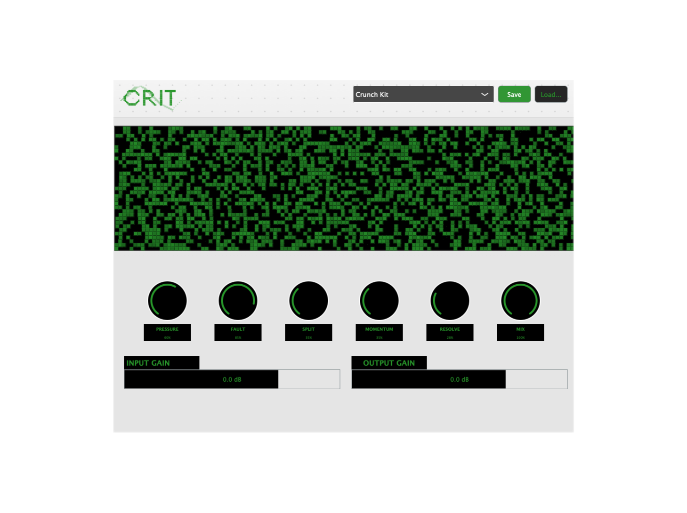

# crit 

A plugin for controlled instability. designed for 'distorted pop' production.
## Install
MacOSX_silicon_installer.pkg
MacOSX_intel_installer.pkg
Windows_64_86_installer.exe - coming
## Overview
**crit** models behavior under load, not static effects. every control alters how the system responds to audio over time, creating organic instability and metallic character.
### Compatibility:
- Originally tested on Logic Pro
- Validated on pluginval
## What Do My Knobs Mean?
### 1. Pressure: stress it out.
- Waveshaping: sine-foldback distortion and hard-clipping.
- Slew limiter: limits the signal’s maximum voltage change rate to create metallic textures.
- Dynamic EQ: a signal-dependent tilt filter that cuts lows and boosts high-mids as input increases.
- Modulation source: calculates the stress envelope to drive other modules.
### 2. Fault: break it.
- Decimator: dynamic sample-rate reduction triggered by the stress value.
- Jitter: randomized micro-timing offsets that create digital artifacts rather than smooth pitch vibrato.
- Time smearing: very short transient-smearing delays that mimic CPU processing errors.
### 3. Split: rip it.
- M/S comb filter: short, high-feedback delays applied specifically to the stereo side information.
- Phase skew: small timing offsets between left and right saturation curves.
- Haas delay: 1ms to 15ms stereo widening that maintains mono-sum compatibility via high-pass filtering.
### 4. Momentum: shape it.
- Envelope follower: adjusts the attack and release coefficients of the internal stress tracker.
- Smoothing: controls the ramp speed of parameter changes across the audio block.
- Reaction logic: sets the inertia of the plugin, from staccato stutters to lingering tails.
### 5. Resolve: rescue it.
- Upward compressor: amplifies low-level signal details and reverb tails.
- Hard clipper: a zero-latency safety ceiling at the end of the signal chain to prevent digital overs.
- Phase alignment: corrects DC offset and centers the stereo image after aggressive split processing.
### Tips
- This plugin responds to signal level. Quiet sounds don't work as good
- Loud transients disproportionately increase stress
- For subtlety: low Pressure + moderate Fault gives it sizzle
- For aggressive processing: high Pressure + high Resolve is crunchy
- For wide stereo: moderate Split + high Momentum is spacey
## License
MIT License - see LICENSE file for details
## Author
roshan pathak

